# Review-Based-Recommendation-System

## OBJECTIVE

To build web application for product recommendations to customers based on their reviews at the online grocery store. The web application is a prototype to mimic a real time application where the recommendations are rendered with product images for a given input string as a review.


Check it out live [here](https://productrecsystem.herokuapp.com/)

### TABLE OF CONTENTS
* [Data](#data)
* [Technologies](#technologies)
* [Algorithm](#algorithm)
* [Architecture](#architecture)
* [Deployment](#deployment)
* [Results](#results)
* [References](#references)

## Data

The dataset was obtained from [Amazon review dataset](https://nijianmo.github.io/amazon/index.html) released in 2014, provided by UCSD. The dataset contains 287,209 products with 5,074,160 reviews and ratings by 1,57,386 unique users

## Technologies
* Python - Scikit-learn, Pipeline
* Flask 
* Docker
* PowerShell
* Heroku

## Algorithm

We use the k-means algorithm to cluster all the products based on the reviews. The features would form the unsupervised clusters based on TF-IDF scores of the text.

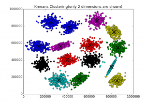 

**How do we do that ?**

Each product's reviews are collected and concatenated as a single string.Thus, each product has the feature set of tf-idf scores for the concatenated string of reviews. Further the tf-idf scores as a feature set is used to find the euclidean distance between selected points in space, thus allowing us to implement the k-means algorithm.

Based on the number of categories in the grocery store, we get to choose the number of centroids and bucket the products with a label. We would train the model, over iterations, allowing the clusters to move farther apart in space and save the model, i.e saving the centroid points in the space. Further, we pickle dump the dictionary of cluster labels and its corresponding products.

The conversion of a string into a tf-idf score and then find its nearest centroid point (cluster) would done using a pipeline function and saved into a joblib file.

**What is TF-IDF score ?**

Given a **document**(concatenated string of a product) in a **corpus**(across the reviews of all products), It tells how rarely a word occurs accross the corpus and how frequently it occurs in a that particular document.

**Example for intution**

Consider comparing reviews of chocolates. Let's assume there are three variants in chocolates available in the market. 

***Review for Variant 1*** : This is the best choclate in the world.

***Review for Variant 2*** : I liked this choclate.

Given that similarity of two sentences here is based on Euclidean distance, the reviews would have closer distance due the presence of the word " Chocolate". 

However, there would a be lot of noice and misallocations, but it's possibility is very less as the reviews for grociries would involve some amount of context to express the thoughts. Also we concatenate all the reviews for the product, which reduce the noise by considering the tf-idf scores for each word.

   
## Architecture

The flow of data given a input string is explained in this section. The input string is passed on to the [flask](Docker/webapp.py) application to access pipeline which is saved on joblib [file](Docker/model_pipeline.joblib). The pipeline would return labels which is used by the lookup [file](Docker/product_lkp.pickle1) to return the ASIN IDs. These ASIN IDs are used to generate product URLS which is used to post the recommendations.


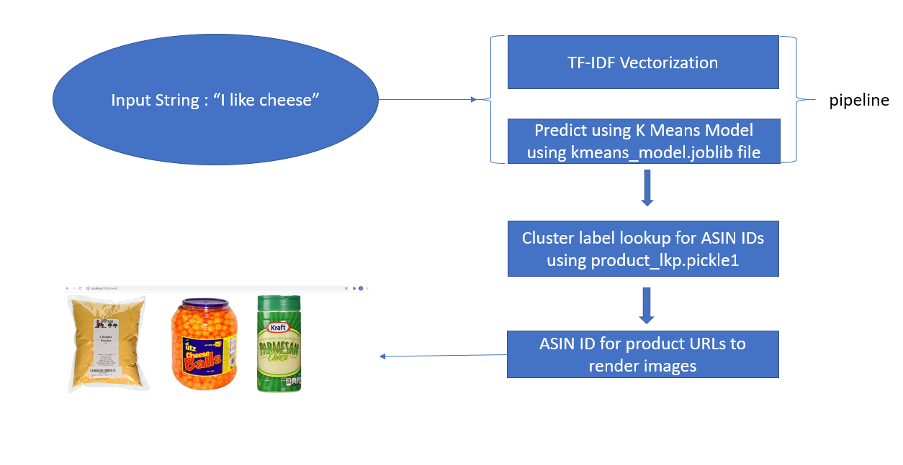

     	 
## Deployment

Once the model is trained with the dataset using the algorithm, we save the model pipeline for deploying flask application on local server or cloud.

The application is deployed on server and further hosted on cloud for public accesss. This can be done with two alternatives depending on the requirements.

**Alternative 1 - Docker Image**

1. A docker folder is created on your local system with the [requirements](Docker/Dockerfile) file. Check the folder [here](Docker)

2. Once the folder is in place, use powershell command line for building the image. On CLI we navigate to the folder we just created.

3. Building the image.

   ``` powershell
   docker image build -t "recommsys".
   ```
   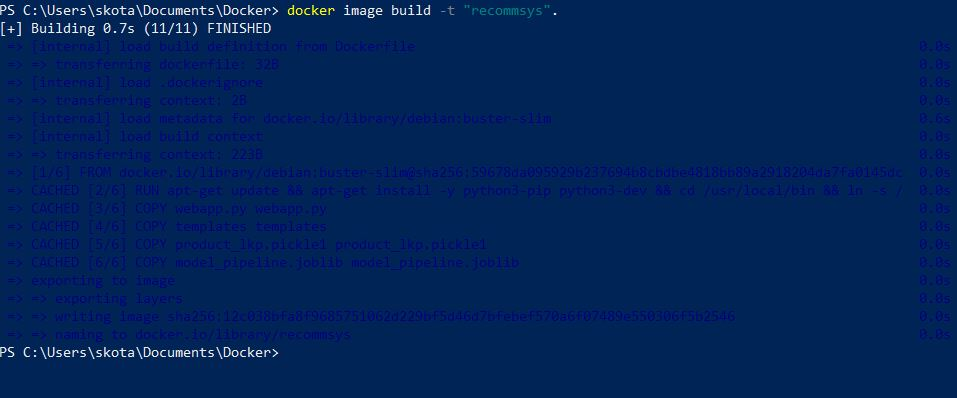

4. Running the application with docker image

   ``` powershell
   docker image build -t "recommsys".
   ```
   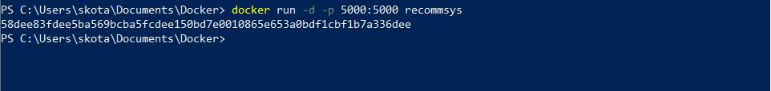
 
5. Verify the image up and running without any errors and further validate for web applicationtio

   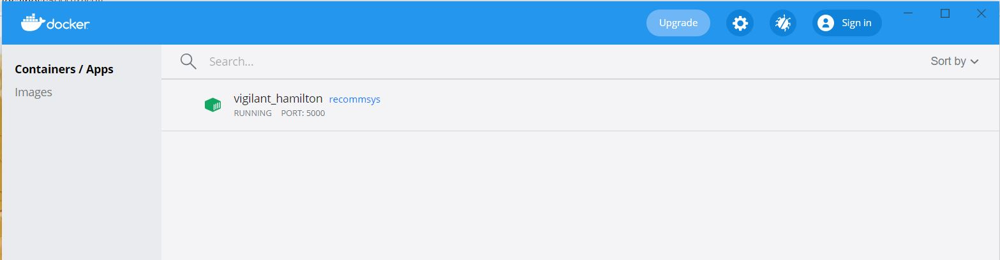
   

6. Validating the application

   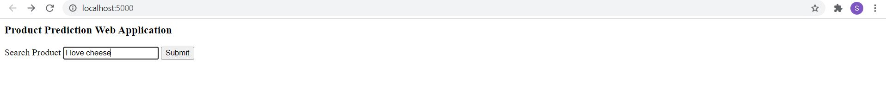

   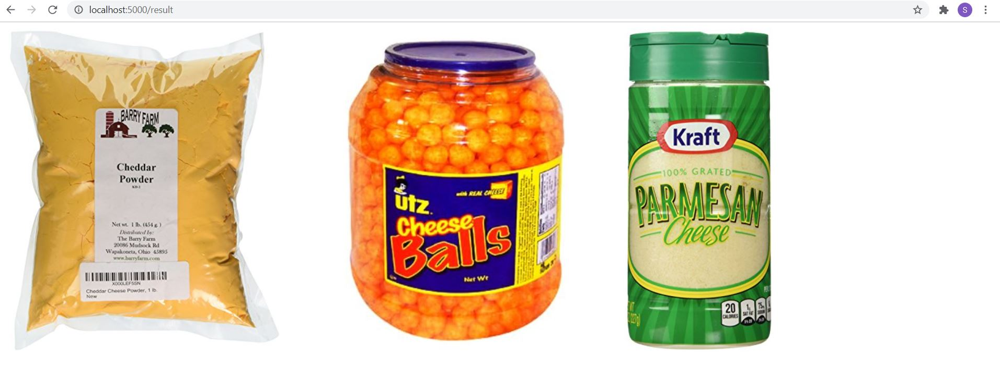   

**Alternative 2 - Heroku Deployment using container (Cloud deployment)****

1. A docker folder is created on your local system with the [requirements](Docker/Dockerfile) file. Check the folder [here](Docker)

2. Once the folder is in place, use command prompt as the Heroku CLI, installed on the system. We use heroku container and push the Docker folder and create the image on heroku to host the application.

3. Check if heroku is installed by following the below command, else check [here](https://devcenter.heroku.com/articles/heroku-cli)
   ``` cmd
   heroku
   ```
   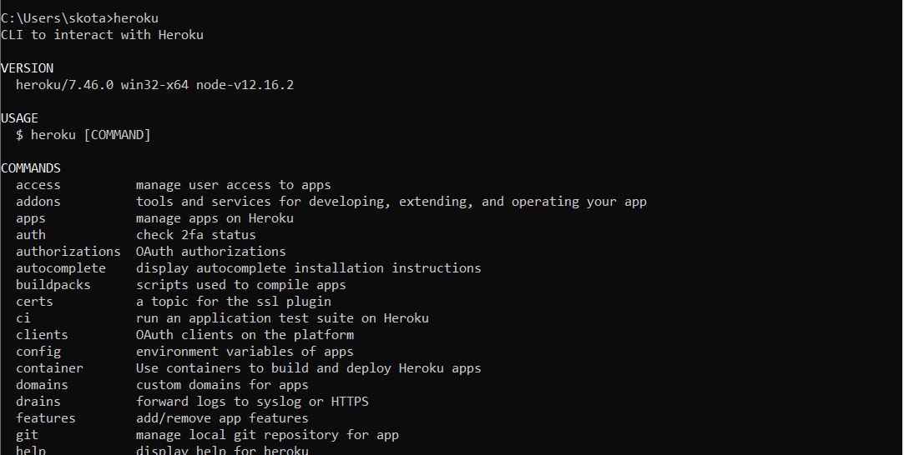

4. Now login into heroku container

   ``` cmd
   heroku container: login
   ```
   
   Create dummy application
   
   ``` cmd
   heroku create recommsys
   ```
   
   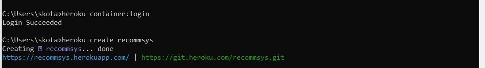
 
5. Now push to web directly from the docker folder directly
   
   ``` cmd
   heroku container:push web --app recommsys
   ```
   
   Now release the app to web,
   
   ``` cmd
   heroku container:release web --app recommsys
   ```
   
   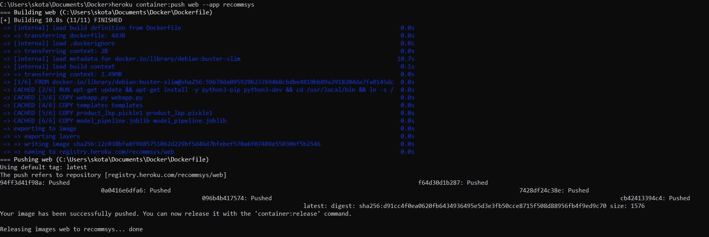

6. Now open in web page, command line shortcut is 
   
   ``` cmd
   heroku open --app recommsys
   ```   
   
   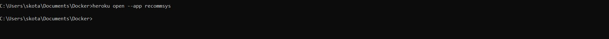

## Results

 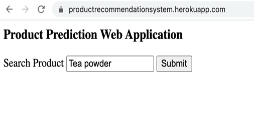
 
 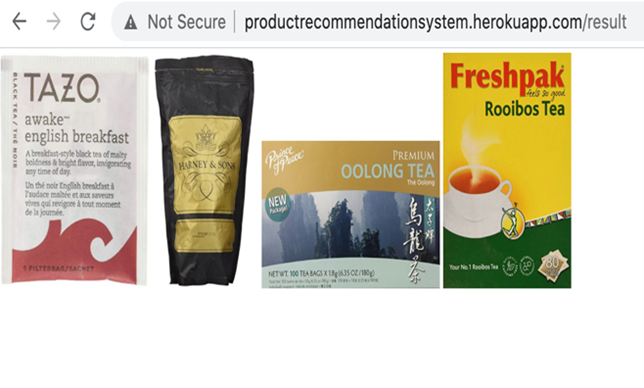
  
 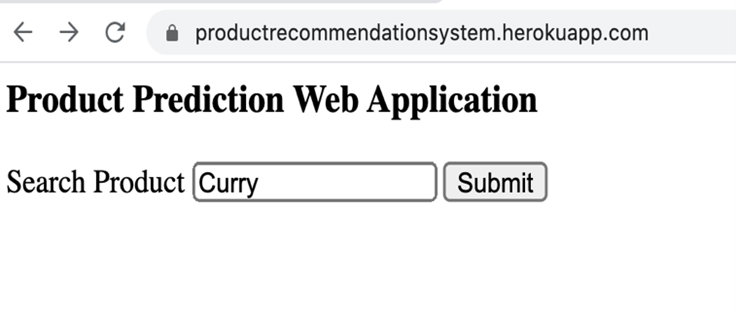
  
    

## References

1. https://docs.docker.com/develop/develop-images/dockerfile_best-practices/
2. Data Science in Production: Building Scalable Model Pipelines with Python – Ben G. Weber 
3. https://help.heroku.com/4RNZSHL2/
4. https://aws.amazon.com/
5. https://towardsdatascience.com/deploy-machine-learning-pipeline-on-cloud-using-docker-container-bec64458dc01
6. https://medium.com/analytics-vidhya/deploy-your-machine-learning-model-on-docker-ee2b931e133c
7. https://medium.com/analytics-vidhya/deploy-machinelearning-model-with-flask-and-heroku-2721823bb653


